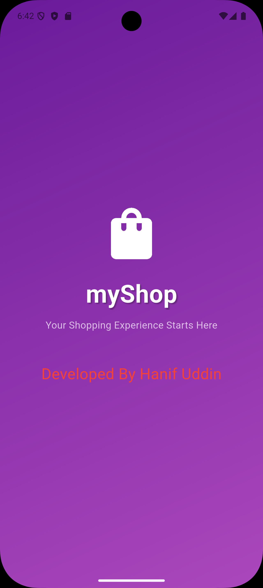
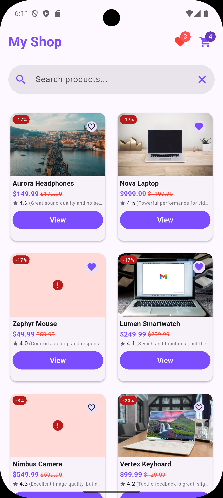
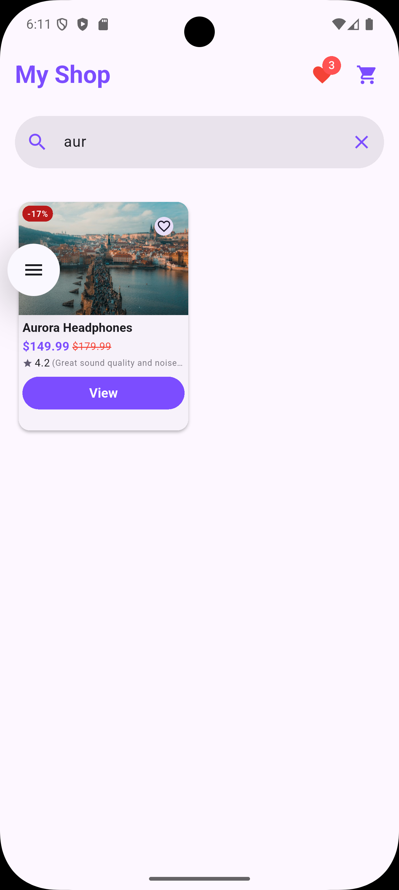
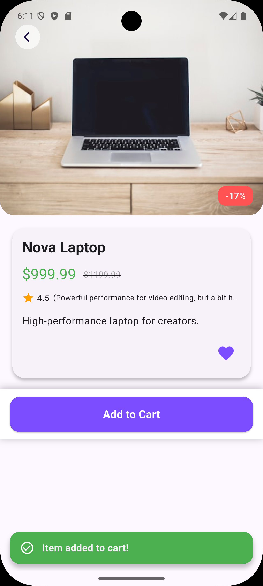
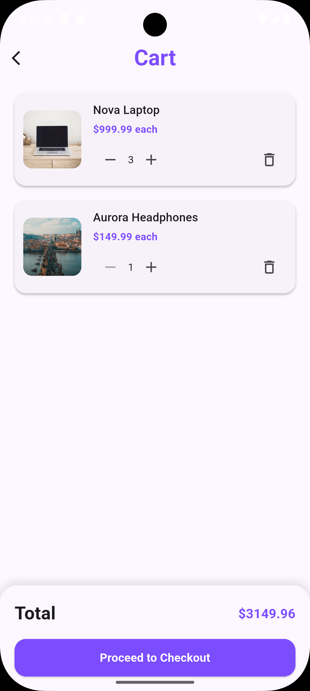
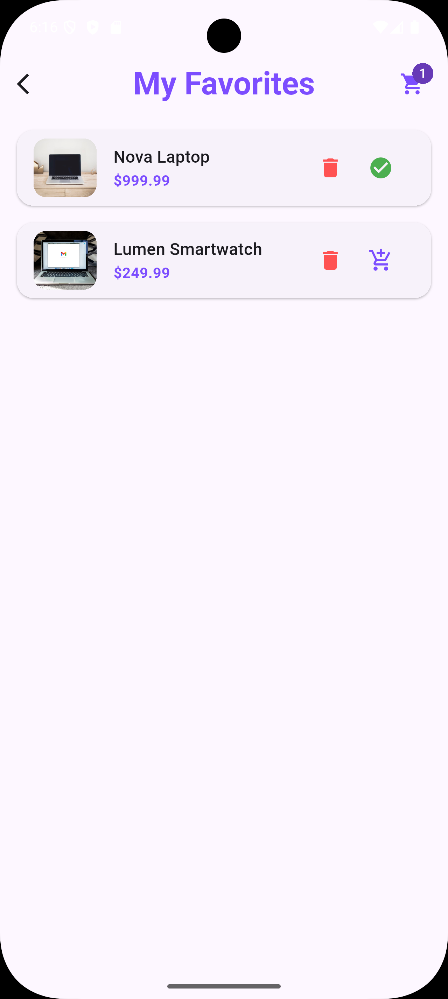
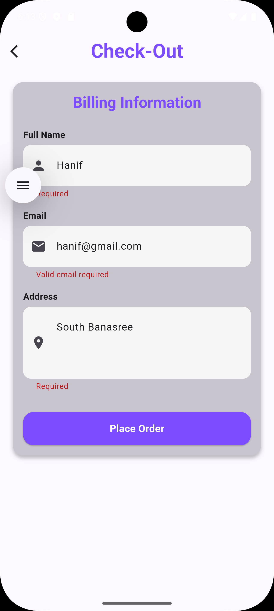
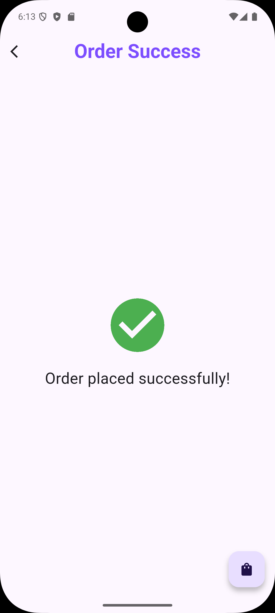

# My Shop - Flutter Shopping App

## Overview
This is a small Flutter application that simulates a shopping experience. It allows users to browse a product catalog, add/remove items to/from a cart, mark products as favorites, and complete a simple checkout flow. The app uses Riverpod for state management and follows the repository pattern for data handling.

## Architecture overview
lib/
├── data/
│   └── repositories/
│       └── product_repository.dart
├── models/
│   └── products.dart
├── provider/
│   ├── cart_provider.dart
│   ├── favourites_provider.dart
│   └── product_provider.dart
├── widgets/
│   ├── buttons/
│   ├── product_widgets/
│   └── shimmer/
├── product_details_view.dart
├── product_list_view.dart
└── main.dart

## Features
### Mid-Level

- Display a list of products loaded from local JSON (mock API).
- Show product details on tap.
- Support pull-to-refresh for the product list.
- Add/remove products from a cart.
- Show cart summary with total price.
- Search products by name.
- Mark/unmark products as favorites.
- Persist favorites & cart data across app restarts using SharedPreferences.
- Checkout with a simple form (name, email, address) leading to a success screen.
- Implement repository pattern (separating data, domain, and UI layers).
- Show proper loading, empty, and error states with retry options.
- Cache the last product list for offline startup.
- Write unit tests for cart logic, favorites toggle, and repository error handling.
- Pass lint checks with no warnings.

## Tech Stack
- **Flutter**: Latest stable version(3.35.3 ).
- **State Management**: Riverpod (`flutter_riverpod`).
- **Models**:  standard Dart models.
- **Persistence**: SharedPreferences.
- **Networking**: `http` or `dio` (used for mock API simulation).
- **Navigation**: `go_router` or Navigator 2.0.

## Data Model
- **Product**: Includes fields like `id`, `name`, `presentPrice`, `prevPrice`, `imageUrl`, `description`.

## Installation(Setup Steps )
1. Clone the repository: https://github.com/hanifuddin15/myshop.git
2. Install Flutter 3.35.3 • channel stable • https://github.com/flutter/flutter.git
Tools • Dart 3.9.2 • DevTools 2.48.0

## Screenshots

### Splash Screen

### Product List

### Product Search

### Product Details

### Cart

### Favorites

### Checkout

### Order Success

